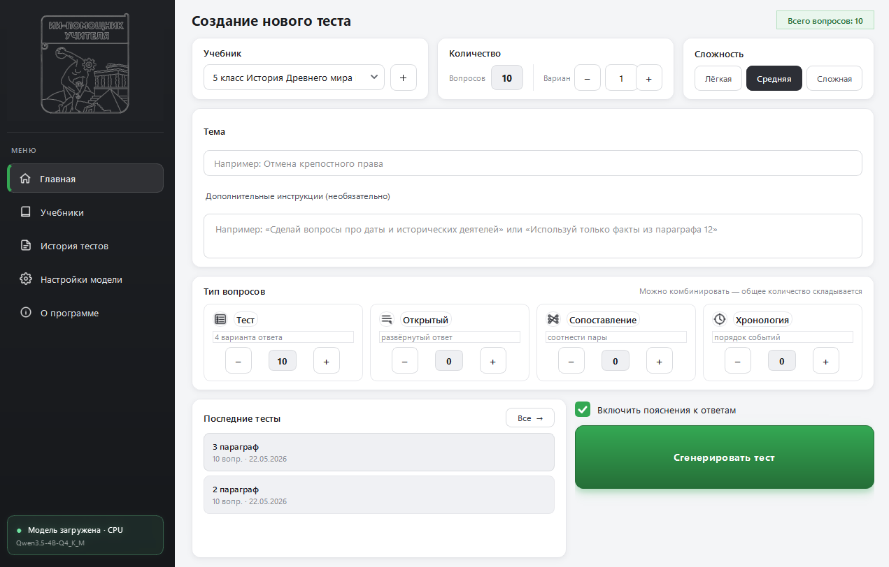
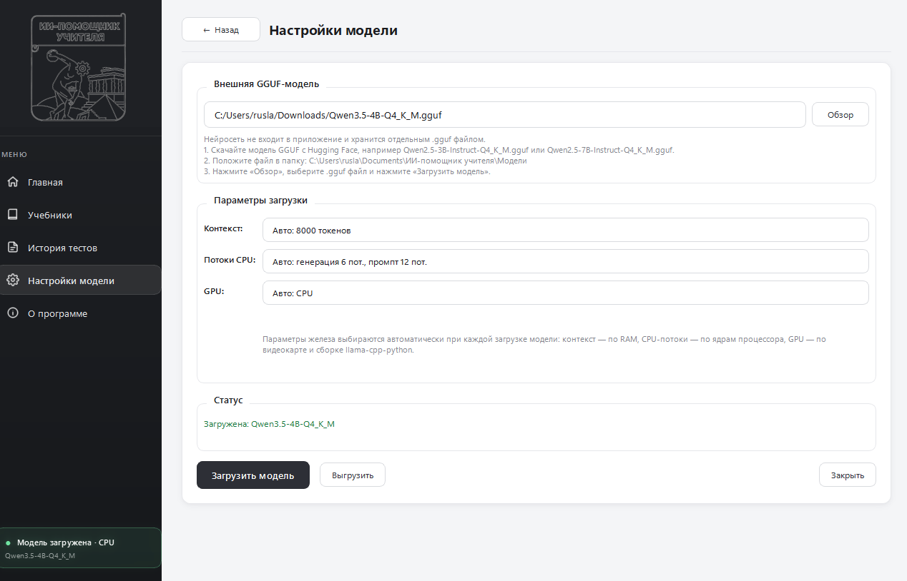
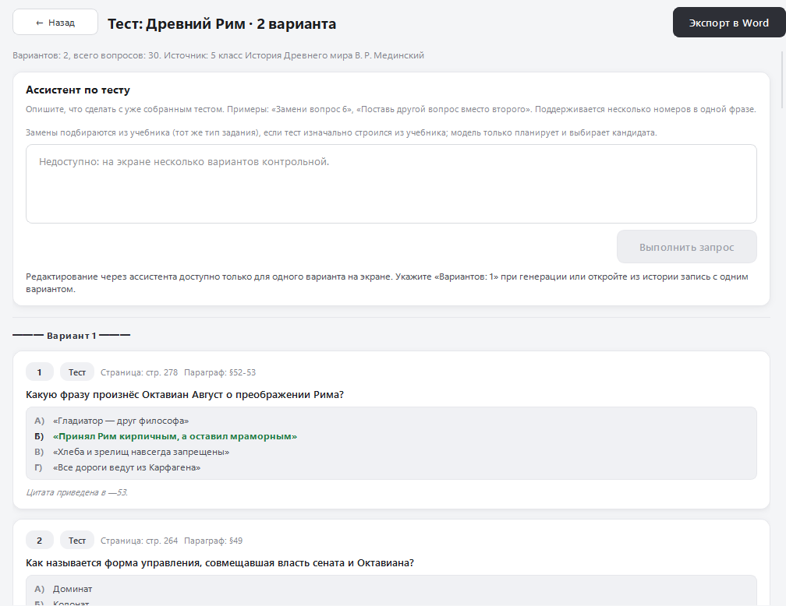
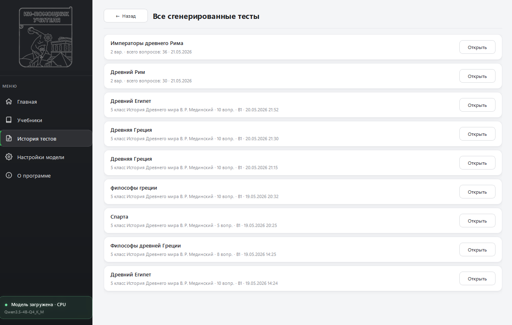
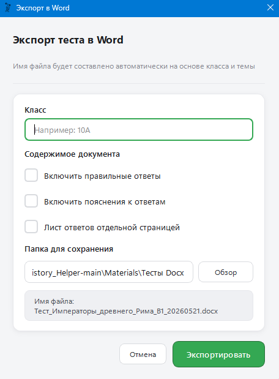
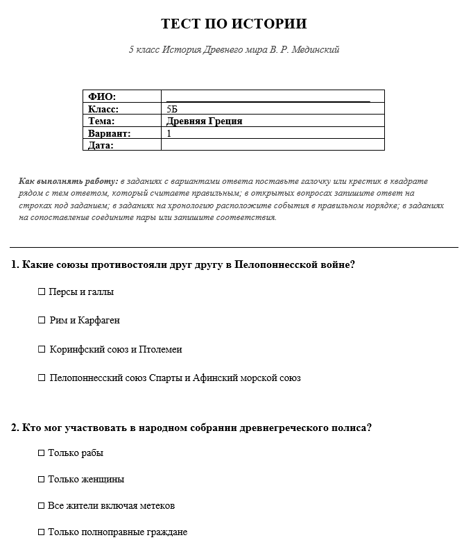
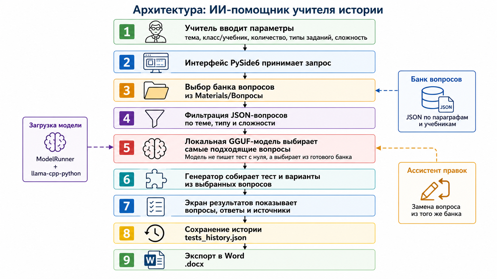

# ИИ-помощник учителя истории

Десктопное приложение для подготовки тестов по истории. Учитель выбирает учебник и тему, задаёт количество и типы вопросов, после чего получает готовые варианты теста с ответами и ссылками на страницы учебника. Результат можно проверить, изменить и выгрузить в Word.

Проект сделан как выпускная квалификационная работа. Идея появилась после обсуждения с учителем истории: на составление и оформление проверочных работ уходит много времени, а готовые материалы не всегда подходят под нужную тему и сложность. Поэтому основная задача приложения — упростить обычную подготовку теста, но оставить итоговую проверку за учителем.

## Что умеет приложение

На главном экране можно выбрать учебник, тему, сложность, количество вариантов и разные типы заданий: тестовые, открытые, на сопоставление и хронологию. Вопросы хранятся в подготовленном JSON-банке и связаны с конкретными параграфами и страницами учебников.

Локальная GGUF-модель не пишет весь тест с нуля. Она выбирает подходящие задания из банка с учётом настроек пользователя. Это позволяет запускать программу без отправки материалов во внешние сервисы. Готовый тест сохраняется в истории, отдельный вопрос можно заменить, а результат экспортировать в `.docx`.



## Работа с моделью

Модель подключается отдельным GGUF-файлом. В настройках приложение показывает выбранную модель и параметры загрузки. Контекст, число потоков CPU и режим GPU определяются автоматически, но сам файл модели пользователь скачивает отдельно.



## Результат и история тестов

После генерации учитель видит вопросы, варианты ответов, правильные ответы и источник. Ранее подготовленные тесты остаются в истории, поэтому их можно открыть повторно и использовать как основу для новой работы.





## Экспорт в Word

Перед экспортом можно указать класс и выбрать, нужны ли в документе правильные ответы, пояснения и отдельный лист ответов. На выходе получается обычный файл Word, который можно поправить вручную или сразу распечатать.

<p align="center">
  
  
</p>

## Как устроен проект

Интерфейс принимает параметры теста, затем программа фильтрует вопросы по учебнику, теме, сложности и типу. Локальная модель помогает выбрать подходящие задания, генератор собирает варианты, после чего результат сохраняется в истории и может быть экспортирован в Word.



Приложение написано на Python. Для интерфейса используется PySide6, для запуска локальной модели — `llama-cpp-python`, для работы с GGUF-моделями — формат GGUF, а для формирования документов — `python-docx`. Данные о вопросах и история тестов хранятся в JSON.

## BPMN-схема

Отдельно я описал основной пользовательский сценарий в BPMN 2.0: от настройки теста до проверки, замены вопроса и получения файла `.docx`. В схеме разделены действия учителя и приложения, а также показаны два возможных продолжения после проверки теста.


Исходник BPMN и другие материалы системного анализа находятся в отдельном репозитории [system-analysis](https://github.com/us6fu1/system-analysis).

## Проверка проекта

Основной сценарий приложения был проверен вместе с учителем истории. Во время работы уточнялись нужные параметры теста, формат вопросов и содержание итогового документа. Учитель также просматривал банк вопросов и проверял соответствие заданий учебникам. Это учебный проект, а не коммерческий продукт, поэтому перед использованием готового теста учителю всё равно нужно проверить формулировки и ответы.

## Как скачать готовую программу без Python

Откройте раздел **Releases** на странице проекта и в блоке **Assets** скачайте архив `СКАЧАТЬ-ГОТОВОЕ-ПРИЛОЖЕНИЕ-windows.zip`. После распаковки положите GGUF-модель в папку `models` рядом с программой и запустите файл `ИИ-помощник учителя.exe`.

```text
ИИ-помощник учителя\
  ИИ-помощник учителя.exe
  models\
    Qwen3.5-4B.Q4_K_M.gguf
```

GGUF-модель не входит в архив, потому что она занимает несколько гигабайт. Также приложение проверяет папку `Документы\ИИ-помощник учителя\Модели`. Если файлов несколько, нужную модель можно выбрать в настройках.

## Запуск из исходников

Для запуска нужен Python 3.10 или новее.

```powershell
cd Test_generator
pip install -r requirements.txt
python main.py
```

Для сборки Windows-версии из корня проекта можно запустить:

```bat
build_exe.bat
```

Готовая сборка появится в папке `Test_generator\dist\ИИ-помощник учителя`. В репозитории также есть workflow `.github/workflows/build-windows.yml` для сборки через GitHub Actions.

## Ограничения

Качество подбора зависит от используемой модели и содержимого банка вопросов. Программа работает локально, поэтому скорость генерации зависит от компьютера. Сейчас приложение рассчитано на подготовленные учебники и JSON-банки, которые уже находятся в проекте; автоматическое добавление любого нового учебника ещё не реализовано.
